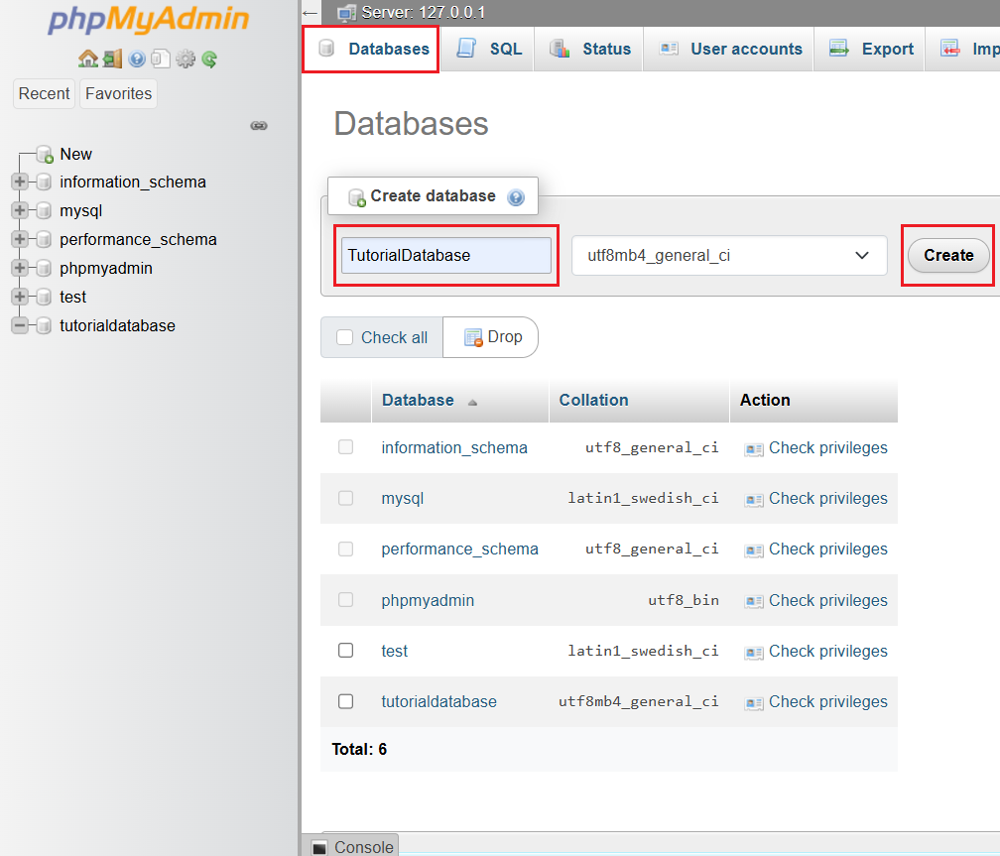
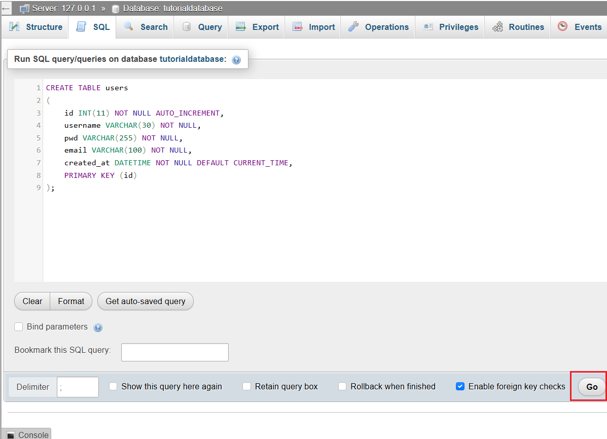
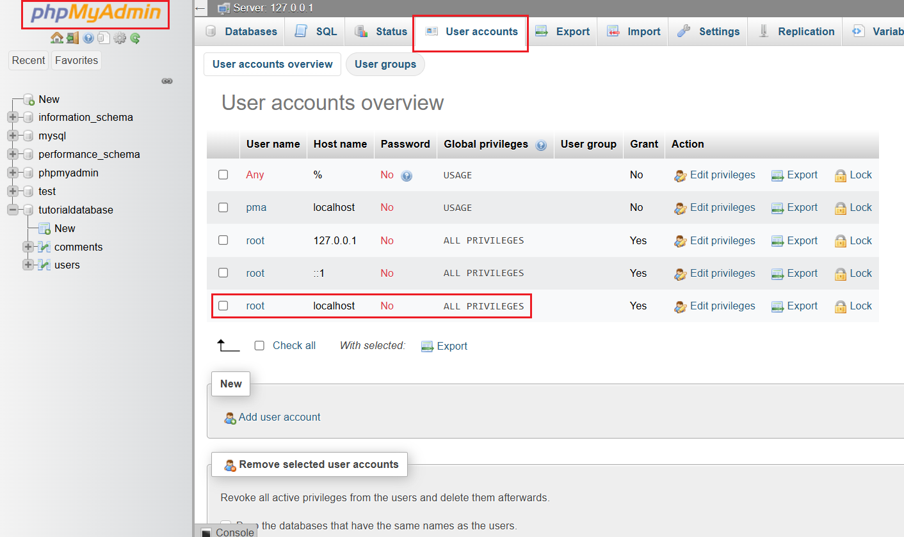
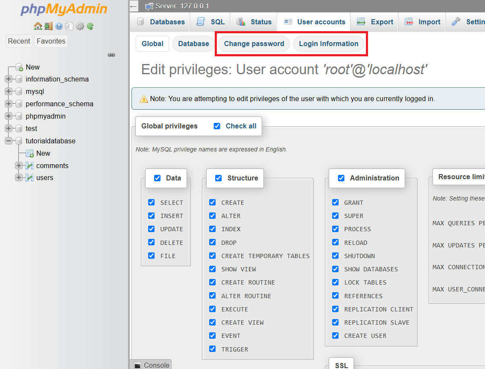

# Setup Database
1. To access `phpmyadmin`, use this url: `http://localhost:8080/phpmyadmin` (might differ based on port number).

1. To create your own database, click on the `databases` tab and enter your first database's name, everything else can be left as default. Click `create` to create the database.

    

1. While you can use `phpmyadmin` to create tables in your database, it is preferred to do it manually using `SQL`, as it can later be applied to `php`.

1. To write `SQL` in your databse, make sure you're selecting the correct database > `SQL` tab at the top. 

1. To create a table:
    ```sql
    CREATE TABLE users
    (
        id INT(11) NOT NULL AUTO_INCREMENT,
        username VARCHAR(30) NOT NULL,
        pwd VARCHAR(255) NOT NULL,
        email VARCHAR(100) NOT NULL,
        created_at DATETIME NOT NULL DEFAULT CURRENT_TIME,
        PRIMARY KEY (id)
    );
    ```
    1. Make sure `TABLE` name is NOT using any built-in names in MYSQL.
    1. Make sure vairable names are also NOT using any built-in names in MYSQL (e.g. password).

1. To save and run the database, click on the go button below.

    

1. To create a foreign key:
    ```sql
    CREATE TABLE comments
    (
        id INT(11) NOT NULL AUTO_INCREMENT,
        username VARCHAR(30) NOT NULL,
        comment_text TEXT NOT NULL,
        create_at DATETIME NOT NULL DEFAULT CURRENT_TIME,
        users_id INT(11),
        PRIMARY KEY (id),
        FOREIGN KEY (users_id) REFERENCES users (id) ON DELETE SET NULL
    );
    ```
    1. When referencing a column from another table in current table, MUST be the same data type as in referenced table!

1. To insert data into database:
    ```sql
    INSERT INTO users (username, pwd, email) VALUES ('Daniel', 'Password', 'Dandadan@gmail.com');
    ```

1. To update data in database:
    ```sql
    UPDATE users SET username = 'LIGMASIGMA', pwd = "P@ssw0rd" WHERE id = 2;
    ```

1. To delete data in database:
    ```sql
    DELETE FROM users WHERE id = 1;
    ```

1. To select data in database:
    ```sql
    SELECT username, email FROM users WHERE id = 2;
    /* To select everything */
    SELECT * FROM users WHERE id = 2;
    ```

1. To select data from multiple tables:
    ```sql
    SELECT * FROM users INNER JOIN comments ON users.id = comments.users_id;
    /* Result: Shows all users who made comments */

    /* Left Join */
    SELECT * FROM users LEFT JOIN comments ON users.id = comments.users_id;
    /* Result: Shows all users (including ones with no comments), but users with no comments will have NULL shown under comments */

    /* Right Join*/
    SELECT * FROM users RIGHT JOIN comments ON users.id = comments.users_id;
    /* Result: Shows all comments (including ones with no user), but comments with no user will have NULL shown under user */
    ```

1. To change stats for users, go to `phpMyAdmin > User Accounts` and find the localhost `Host Name` and root `User Name`. Select that.

    

1. You can change the login info for this user by clicking on `Login Information` near the top. You can change the `Username` to anything you want, but DO NOT change the password directly here. There is a bug.

    

1. To change password, click on `Change Password` tab near the top and do it there.

1. To connect database to PHP website, there are 3 methods:
    1. `mysql` (deprecated & unsafe. Do not use this.)
    1. `mysqli`
    1. `PDO`

1. Back to PHP, `pmtweb` uses `mysqli`, so we'll be using that as well. Create a file named `config.php` and write this:
    ```php
    <?php
    $host = "localhost";
    $dbusername = "root";
    $dbpassword = "";
    $dbname = "tutorialdatabase";

    $link = mysqli_connect($host, $dbusername, $dbpassword, $dbname);
    if (!$link) {
        die("Connection failed: " . mysqli_connect_error());
    }
    ```
    1. This uses the `mysqli_connect` function to connect localhost to `tutorialdatabase` using the `root` user.

1. Congrats! You can start building your own website and send data into your database!